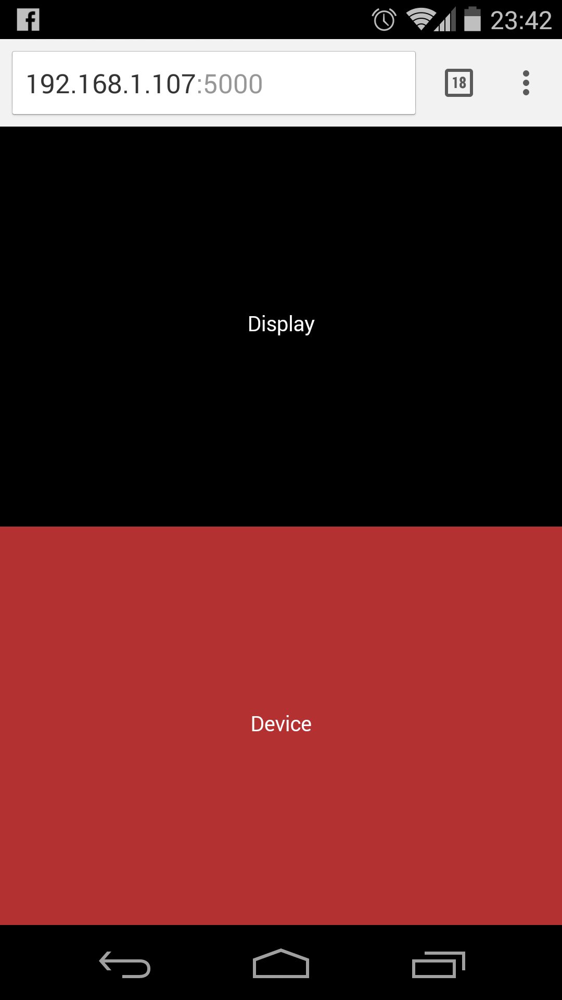

# Tilt visualization

Visualize the tilt (orientation) of your mobile device via web sockets ([socket.io](http://socket.io)).

## To setup locally:

1. Install node.js
2. `npm install`
3. `node app.js`
4. Find the IP of the server (e.g. `ifconfig`)
5. Browse to `{IP}:5000` on **one or more** devices and choose "Display mode"
6. Browse to `{IP}:5000` on a device supporting the `deviceorientation` event (e.g. a mobile phone) and choose "Device mode"
7. ~~Profit!~~Play!

## Screenshots

